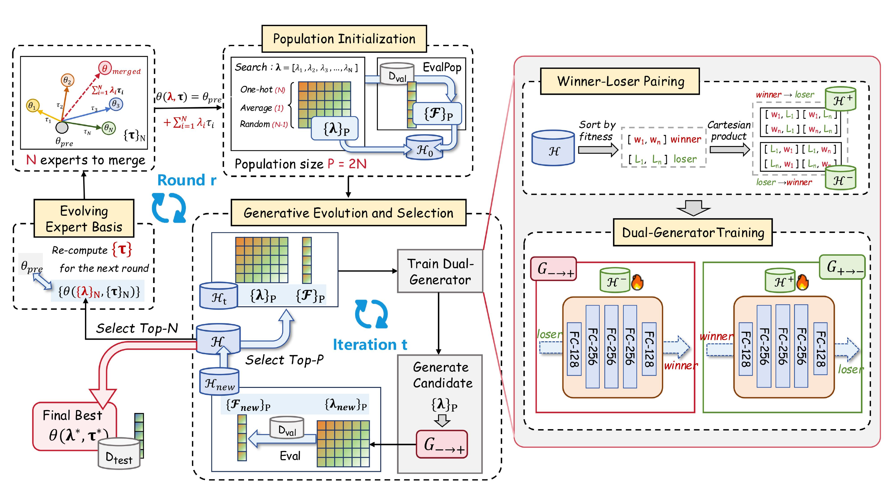

<h1 align="center">
🌟 EvoGM: Learning to Merge LLMs via Evolutionary Generative Optimization 🌟
</h1>

<div align="center">
  
</div>

*EvoGM addresses evolutionary model merging as a learnable search problem. Instead of relying on hand-crafted mutation or crossover operators, it treats validation performance as feedback and learns where high-quality merging coefficients are likely to lie.*

**Accepted at ICML 2026**

## Method Contributions

- **Generative model merging.** We propose EvoGM, which reformulates evolutionary model merging as a learnable generative optimization problem for adaptive search in the merging space.

- **Preference-aware dual generation.** We introduce a cycle-consistent dual-generator with a winner–loser preference strategy to better leverage sparse validation feedback and synthesize effective merged models for unseen tasks.

- **Strong empirical performance.** Extensive experiments across diverse benchmarks and model families show that EvoGM consistently outperforms state-of-the-art model merging baselines.

## Environment

Use Python 3.10. A fresh environment is recommended. The requirement files are pinned to the core packages used by the released experiments rather than a minimal import-only set.

GPU:

```bash
python -m venv .venv
source .venv/bin/activate
pip install -U pip
pip install -r requirements-gpu.txt
pip install -e .
```

NPU:

```bash
conda create -n evogm_npu python=3.10 -y
conda activate evogm_npu
pip install -U pip
# Install torch and torch_npu for your CANN version first, then:
pip install -r requirements-npu.txt
pip install -e .
```

NPU runs require a working Ascend driver, CANN runtime, `npu-smi`, and a `torch_npu` build matching your PyTorch/CANN stack.

The NPU experiments were checked against the project environment named `evogm_npu` on Ascend machines with CANN 8.1.RC2, PyTorch 2.5.1, and `torch-npu` 2.5.1. If your cluster uses another CANN release, install the matching PyTorch/`torch_npu` pair first and then install the pinned Python packages from `requirements-npu.txt`. Do not let a generic PyPI torch wheel replace the Ascend-compatible build.

## Model Weights

Model weights are not included in this repository. Download the Qwen2.5-1.5B base model plus the 10 released Tulu v2 LoRA expert adapters from:

```text
https://huggingface.co/TaoJiangCN/qwen2.5-1.5b-tulu-v2-lora-experts
```

With `huggingface-hub` installed, one direct way to fetch the weights is:

```bash
huggingface-cli download TaoJiangCN/qwen2.5-1.5b-tulu-v2-lora-experts \
  --local-dir models/qwen25-1.5b-lora-experts
```

The downloaded files should be arranged like this:

```text
models/qwen25-1.5b-lora-experts/
  base/
    config.json
    model.safetensors or model.safetensors.index.json
    tokenizer files...
  experts/
    tulu_code_alpaca/adapter_config.json
    tulu_cot/adapter_config.json
    tulu_flan_v2/adapter_config.json
    tulu_gpt4_alpaca/adapter_config.json
    tulu_lima/adapter_config.json
    tulu_oasst1/adapter_config.json
    tulu_open_orca/adapter_config.json
    tulu_science/adapter_config.json
    tulu_sharegpt/adapter_config.json
    tulu_wizardlm/adapter_config.json
```

The default configs read from `models/qwen25-1.5b-lora-experts`. You can override the location:

```bash
export EVOGM_MODEL_DIR=/path/to/qwen25-1.5b-lora-experts
```

You can also override the dataset directory:

```bash
export EVOGM_DATA_DIR=/path/to/swarm_eval
```

## Setup Check

Run the setup check before launching experiments:

```bash
bash scripts/check_setup.sh
```

For NPU machines, use the stricter NPU check:

```bash
bash scripts/check_setup.sh npu
```

This validates imports, key package versions, Hydra config composition, bundled task data, and prints model layout guidance. In NPU mode it also verifies that `torch_npu` is installed and `torch.npu` is available. Missing model weights are reported clearly because weights are expected to be downloaded separately.

## Example

After model weights are in place, run a minimal smoke test. It creates a temporary one-example dataset from the bundled JSON files and uses tiny EvoGM search settings.

GPU:

```bash
bash scripts/smoke_test.sh gpu
```

NPU:

```bash
bash scripts/smoke_test.sh npu
```

## Full Experiments

GPU multi-task:

```bash
bash scripts/run_gpu_multi.sh
```

GPU single-task over all 8 task entries:

```bash
bash scripts/run_gpu_single.sh
```

GPU single-task for one task:

```bash
bash scripts/run_gpu_single.sh 'method.target_tasks=[gsm8k]'
```

NPU multi-task:

```bash
bash scripts/run_npu_multi.sh
```

NPU single-task:

```bash
bash scripts/run_npu_single.sh
```

NPU single-task for one task:

```bash
bash scripts/run_npu_single.sh 'method.target_tasks=[gsm8k]'
```

You can override device visibility in the usual way:

```bash
CUDA_VISIBLE_DEVICES=0,1,2,3,4,5,6,7 bash scripts/run_gpu_multi.sh
ASCEND_RT_VISIBLE_DEVICES=0,1,2,3,4,5,6,7 bash scripts/run_npu_multi.sh
```

## Ackonwledge

- Motivated by [EvoGO](https://github.com/EMI-Group/evogo), which extends the [EvoX](https://github.com/EMI-Group/evox) framework with generative evolutionary optimization, EvoGM introduces a learnable generative search mechanism for LLM model merging.

